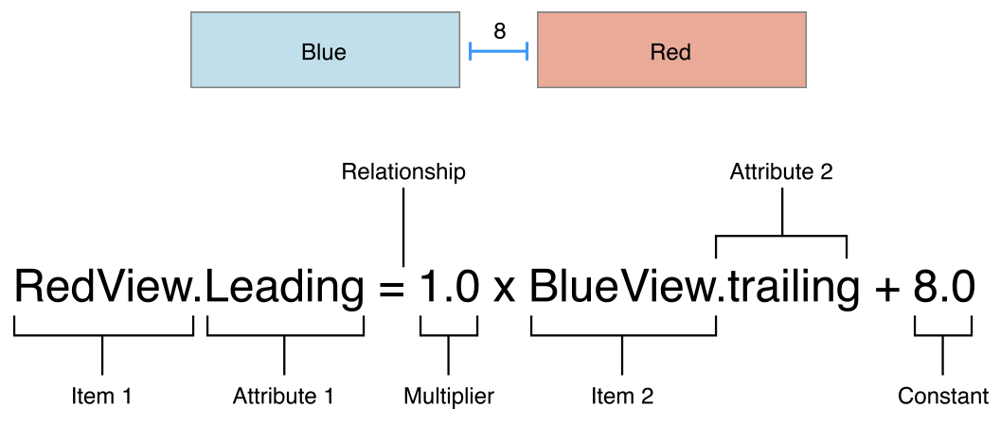

# AutoLayout

- 오토 레이아웃은 보통 제약들을 이용해서 정한다.
- 제약은 일반적으로 두 뷰사이의 관계를 나타냄.
- 오토 레이아웃은 사이즈와 위치를 각각의 뷰를 기반하여 계산.
- 오토 레이아웃은 내 외부의 변화에 대응 가능.

**Auto Layout Without Constraints**

---

 스택 뷰를 사용하면 제약을 설정하지 않고 오토레이아웃을 만들 수 있다. 스택 뷰는 수평방향이나 수직방향으로 구성요소들을 배치하는데 스택뷰의 설정에 따라 자동으로 정렬 가능. 또한 스택 뷰 안에 스택 뷰를 넣을 수 있다.

**Anatomy of a Constraint**

---




- GreenView의 Trailing(오른쪽)은 레드뷰의 오른쪽보다 2배라 적혀 있음.
- 정사각형의 하 변의 길이는 100
- 현재 레드뷰는 오른쪽이 200만큼 떨어져 있음. 따라서 초록뷰는 오른쪽이 400만큼 떨어지게 된다. 그러므로 초록뷰의 폭은 300이 됨.


- RedView.trailing은 150, GreenView.trailing은 300이 된다. 따라서 초록뷰의 폭은 250이 된다.
- 만일 2 * RedView.trailing + 50을 한다면 그린뷰의 끝은 노란뷰의 끝까지 간다.


**Auto Layout Attributes**

---

 하나의 뷰를 기준으로 뷰의 위 아래 왼쪽 오른쪽 거리를 둘 수 있다. 또한 뷰의 높이와 넓이를 정할 수 있다. centerX는 x축(가로)의 중앙, centerY는 y축(세로)의 중앙


```
// Setting a fixed distance between two buttons
Button_1.trailing = 1.0 * Button_2.leading - 8.0

// Aligning the leading edge of two buttons
Button_2.leading = 1.0 * Button_1.leading + 0.0

// Give two buttons the same width
Button_2.width = 1.0 * Button.width + 0.0

// Center a view in its superview
Superview.centerX = 1.0 * View.centerX + 0.0
Superview.centerY = 1.0 * View.centerY + 0.0

// Give a view a constant aspect ratio
View.width = 0.5 * View.height + 0.0
```

**Creating Nonambiguous, Satisfiable Layouts**

---

오토 레이아웃을 설정할 때는 모든 값이 명백하게 정해져 있어야 한다. 즉 모호한 표현이 있으면 안된다.

- 내부의 진한 회색사각형 뷰(이하 뷰)를 그리는 것. 외부의 연한 회색뷰는 슈퍼 뷰(superView)


1. 왼쪽: 뷰의 폭을 맡고 있다. 뷰의 폭만 알고 있으면 뷰가 정확히 어디에 위치하는지 알 수 없다. 따라서 뷰의 왼쪽 제약을 정해준다. 이제 뷰가 정확히 어디어 어떤크기로 위치하는지 알 수 있다.
2. 가운데: 뷰의 폭은 알지 못한다. 하지만 뷰의 왼쪽, 오른쪽 여백의 제약을 알고 있다. 따라서 뷰의 폭은 슈퍼뷰에서 두 제약을 뺀만큼이 된다. 역시 뷰의 크기와 위치를 알 수 있다.
3. 오른쪽: 뷰의 폭은 알지 못한다. 하지만 뷰의 왼쪽 여백의 제약을 알고 있다. 그리고 뷰의 중앙이 슈퍼뷰의 중앙과 일치한다. 그렇다면 뷰의 오른쪽도 왼쪽과 대칭이 되기 때문에 뷰의 크기와 위치를 정확히 알 수 있다.

**Constraint Inequalities**

---

```
// A single equal relationship
Blue.leading = 1.0 * Red.trailing + 8.0

// Can be replaced with two inequality relationships
Blue.leading >= 1.0 * Red.trailing + 8.0
Blue.leading <= 1.0 * Red.trailing + 8.0
```


예를 들면, Blue.leading >= 1.0 * Red.trailing + 8.0에서 블루와 레드사이의 간격은 8보다 커질 수 있다. 


**Constraint Priorities**

---

 오토 레이아웃은 모든 제약이 필수. 옵셔널 제약도 만들 수 있다. 모든 제약은 1 ~ 1000 사이의 값을 가진다. 1000을 갖는 제약은 필수제약이고 다른 값은 모두 옵셔널이다. 오토 레이아웃은 모든 제약 조건을 높은 것부터 낮은 것까지 시도해본다.

**Intrinsic Content Size**

---

 어떤 뷰는 뷰 내부의 컨텐츠에 따른 사이즈를 가지는데 이를 intrinsic content size라고 한다. 예를 들어 버튼의 intrinsic content size는 버튼의 제목 보다 약간 큰 크기이다.

UIView and NSView : intrinsic content size 없음

Slider : 폭만 지정함(iOS). 슬라이더 타입에 따라 폭, 높이 지정(OS X)

Labels, buttons, switches, and text fields : 폭과 높이 둘다 정의

Text Views and Image Views : 다양한 intrinsic content size가 있다.

 intrinsic content size가 있을 때 Content hugging과 Content Compression이 있다. 이 둘은 우선 순위를 가진다.


 핑크색이 hugging priority가 더 높아서 최소 크기를 보장받고 주황색은 길어졌다. 

- 우선순위가 높은 핑크색 라벨의 원래 intrinsic content size를 보장한다.
- Content compression: 우선 순위가 높으면 최대 크기를 보장한다.
- Content hugging: 우선 순위가 높으면 최소 크기를 보장.


 주황색이 Compression priority가 더 높아서 최대 크기를 보장받고 핑크색은 짧아졌다.

- 우선순위가 높은 주황색 라벨의 원래 intrinsic content size를 보장한다.

- ***hugging - 다른 것을 끌어 당겨 안는다.***
- ***compression - 다른 것을 압축시킨다.***

**Working with Constraints in Interface Builder**

---

오토 레이아웃 제약을 인터페이스 빌더에서 설정하는 세가지 옵션. 

1. 컨트롤 드래그              2. Pin과 Align 툴              3. 인터페이스 빌더가 설정

**Control-Dragging Constraints**

---

 두 뷰 사이에 제약을 만들려면 컨트롤 클릭 후 다른 뷰로 드래그.


 컨버스 내의 아이템에서 할 수 있고, scene의 도큐먼트 아웃라인에서도 설정 가능하다. 인터페이스 빌더는 현재 뷰의 프레임을 기준으로 제약을 만든다. 그렇기 때문에 뷰의 위치를 정확하게 잡고 제약을 설정해야한다. 필요하다면 제약을 나중에 수정할 수 있다.

**Using the Stack, Align, Pin, and Resolve Tools**

---


여러가지 오토레이아웃 툴이 있다. 스택 뷰를 만들 수 있으며 현재 뷰의 위치에 따라 수평 수직의 스택 뷰를 만든다.

Align Tool

---

빠르게 정렬을 도와주는 툴이다. 인터페이스 빌더가 가능한 정렬을 보여준다.


 두 개 이상의 뷰를 선택하는 것이 일반적이다. 하지만 컨테이너에 수평이나 수직으로 설정할 때 하나의 뷰를 선택할 수 있다. 한 번에 여러개의 제약을 추가할 수 있다.

Pin Tool

---

 이웃한 뷰 등과 빠르게 위치를 정하거나 크기를 만들어준다.


 근처의 뷰 등과 리딩, 탑, 트레일링, 바텀 제약을 만들 수 있다. 역삼각형을 눌러서 이웃하는 뷰 등을 선택할 수 있다. Constrain to Margins를 사용해서 슈퍼뷰의 엣지나 마진에 연결 가능하다.


크기를 지정할 수 있고 현재 뷰의 크기가 나타난다. 숫자를 직접 입력해서 바꿀 수 있다. Aspect Ratio는 현재 비율을 사용하지만 원하면 설정 후 직접 바꿔줘야 한다. 여러개의 뷰를 동시에 선택해서 제약을 동일하게 추가할 수 있다.

Resolve Auto Layout Issues Tool

---

여러가지 오토레이아웃 문제를 해결하기 위해 사용한다.


 현재 제약을 기준으로 뷰를 업데이트하거나, 캔버스안의 뷰의 현재 위치를 통해 제약을 업데이트 할 수 있다. 누락된 제약을 추가하거나, 제약을 삭제하거나, 인터페이스 빌더가 추천하는 제약을 사용할 수 있다.

Letting Interface Builder Create Constraints

---

 인터페이스 빌더는 일부분에서 전체의 제약까지 생성할 수 있다. 현재 캔버스에서 뷰의 사이즈와 위치를 바탕으로 인터페이스 빌더가 최적의 제약을 추론해서 만든다. 작은 차이도 큰 차이를 만들기 때문에 뷰를 아주 신중하게 만들어야한다. Resolve Auto Layout Issues Tool > Reset to Suggested Constraints를 눌러서 제약을 스스로 만든다. 직접 제약을 일부 만들어 놓고 Resolve Auto Layout Issues tool > Add Missing Constraints를 눌러서 나머지 제약을 추가할 수 있다.

**Finding and Editing Constraints**

---

Viewing Constraints in the Canvas

---

- I-bars(lines with T-shaped end-caps). I모양 바는 공간의 크기를 나타낸다. 두 아이템 간의 거리를 나타내거나 아이템의 너비 높이를 나타낸다.
- Plain lines (straight lines with no end-caps). 일반 선(끝이 T모양이 아닌)은 정렬을 나타낸다.
- Solid Lines. 실선은 필수 제약(priority = 1000)
- Dashed Lines. 점선은 옵셔널 제약(priority < 1000)
- Red Lines. 빨간 선은 하나 이상의 아이템의 제약에 에러가 있음을 나타낸다.
- Orange Lines. 주황선은 현재 뷰의 상태와 제약이 일치하지 않을때 나타난다. Resolve Auto Layout Issues tool > Update Frames command를 사용해서 뷰를 업데이트 할 수 있다.
- Blue Lines. 파란선은 제약이 제대로 설정되면 나타난다.
- Equal Badges. (=) 두 아이템이 너비나 높이가 같을 때 나타난다.
- Greater-than-or-equal and less-than-or-equal- badges. (≥, ≤) 크거나 같다, 작거나 같다. 옵션을 나타낸다.


Listing Constraints in the Document Outline

---

 인터페이스 빌더는 모든 제약을 도큐먼트 아웃라인에 리스트로 제공한다.


 Scene의 루트뷰 아래에 제약이 모두 나타난다. 만약에 모든 제약을 보고 싶다면 모든 계층구조를 누르면 된다. 제약은 pseudocode(의사코드)를 사용하여 표시된다. 제약에 관한 정보를 얻을 수 있고 제약을 누르면 해당 제약이 캔버스에 하이라이트 된다.

Finding Constraints in the Size Inspector

---

 현재 선택된 뷰와 관련된 모든 제약을 보여준다. 필수 제약은 실선, 선택 제약은 실선으로 나타난다. 영향을 받는 속성을 나타내고 다른 아이템과의 제약을 보여준다. 다이어그램 속성을 선택해서 필터를 할 수 있다.

Examining and Editing Constraints

---

 Attribute inspector는 모든 제약속성을 보여준다. 첫 번째 아이템, 관계, 두 번째 아이템 값, 몇 배, 우선순위, Identifier(콘솔로드나 디버깅 시 사용가능)


 Placeholder로 지정할 수도 있다. 앱을 실행할 때는 포함되지 않는다. 런타임에 동적으로 제약을 추가할 때 사용한다. 몇몇 값은 사이즈 인스펙터에서 바로 설정할 수 있다.


Setting Content-Hugging and Compression-Resistance Priorities

---

사이즈 인스펙터를 스크롤로 내리면 설정이 나온다.


 intrinsicContentSize method를 통해서 인터페이스 빌더가 intrinsic 사이즈를 정한다. 하지만 필요하다면 직접 placeholder를 정할 수 있다. 캔버스에서만 보이고 실행엔 영향을 미치지 않는다.

**Rules of Thumb**

---

- 뷰의 기하를 프레임이나 바운드, 센터속성으로 정하면 안된다.
- 가능하다면 스택뷰를 사용
- 제약을 가장 가까운 뷰 등에 연결
- 뷰의 고정된 높이나 너비를 사용하는 것을 지양
- 제약을 설정하는데 문제가 있다면, Pin and Align 툴을 사용
- 자동으로 아이템의 프레임을 업데이트 할 때는 조심
- 모든 뷰가 레이아웃에서 의미 있는 이름이 있는지 확인
- 오른쪽 왼쪽이 아니라 leading, trailing을 사용
- iOS에서, 루트뷰의 엣지에 제약을 만들 경우 다음을 따라야 한다.
    - **Horizontal Constrints**. 대부분의 레이아웃 마진에 0점 제약을 사용. 루트 뷰의 마진에서 마진까지 채우는 텍스트 오브젝트는 레이아웃 마진 대시넹 컨텐츠를 읽을 수 있는 가이드를 사용. 루트 뷰의 엣지에서 엣지를 채우는 아이템(배경 등)은 leading trailing 엣지를 사용
    - **Vertical constraints**. 뷰가 bars 아래로 확장되면 top, bottom 마진을 사용(스크롤 뷰). 스크롤뷰의 *contentInset* 와 *scrollIndicatorInsets* 속성을 정확하게 설정해야 한다. 뷰가 bars 아래로 확장되지 않으면 top, bottom 레이아웃 가이드에 제약을 만들어야 한다.
- 코드로 뷰를 만들 때, *translatesAutoresizingMaskIntoConstraints* 속성을 NO로 설정.
- OS X 와 iOS는 레이아웃을 다르게 계산한다.

**Programmatically Creating Constraints**

---

 코드로 오토레이아웃 만드는 방법엔 3가지가 있음. 스토리보드로 뷰 등을 만들고 제약을 코드로 지정할 때 *translatesAutoresizingMaskIntoConstraints = false*를 꼭 해야 한다.

### Layout Anchors

```
// Get the superview's layout
let margins = view.layoutMarginsGuide

// Pin the leading edge of myView to the margin's leading edge
myView.leadingAnchor.constraint(equalTo: margins.leadingAnchor).isActive = true

// Pin the trailing edge of myView to the margin's trailing edge
myView.trailingAnchor.constraint(equalTo: margins.trailingAnchor).isActive = true

// Give myView a 1:2 aspect ratio
myView.heightAnchor.constraint(equalTo: myView.widthAnchor, multiplier: 2.0).isActive = true

//예시
blueView.leadingAnchor.constraint(equalTo: bottomContainer.leadingAnchor).isActive = true
```

### NSLayoutConstraint Class

```
NSLayoutConstraint(item: myView, attribute: .leading, relatedBy: .equal, toItem: view, attribute: .leadingMargin, multiplier: 1.0, constant: 0.0).isActive = true

NSLayoutConstraint(item: myView, attribute: .trailing, relatedBy: .equal, toItem: view, attribute: .trailingMargin, multiplier: 1.0, constant: 0.0).isActive = true

NSLayoutConstraint(item: myView, attribute: .height, relatedBy: .equal, toItem: myView, attribute:.width, multiplier: 2.0, constant:0.0).isActive = true

//예시
let leading = NSLayoutConstraint(item: blueView, attribute: .leading, relatedBy: .equal, toItem: bottomContainer, attribute: .leading, multiplier: 1.0, constant: 0)
```

### Visual Format Language

```
let views = ["myView" : myView]
let formatString = "|-[myView]-|"

let constraints = NSLayoutConstraint.constraints(withVisualFormat: formatString, options: .alignAllTop, metrics: nil, views: views)

NSLayoutConstraint.activate(constraints)

//예시 
let horzFmt = "|[b]|"
let views: [String: Any] = ["b": blueView]
     
let horzConstraints = NSLayoutConstraint.constraints(withVisualFormat: horzFmt, options: [], metrics: nil, views: views)
```
